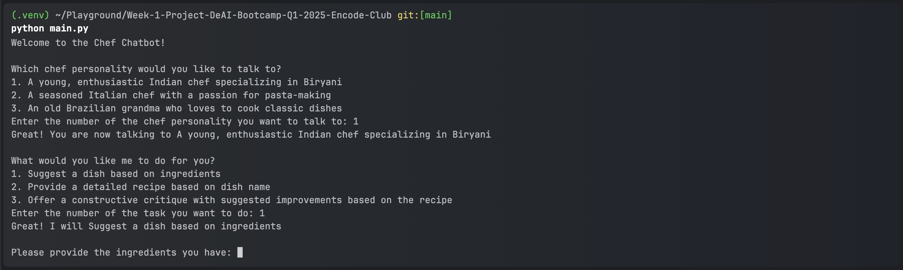
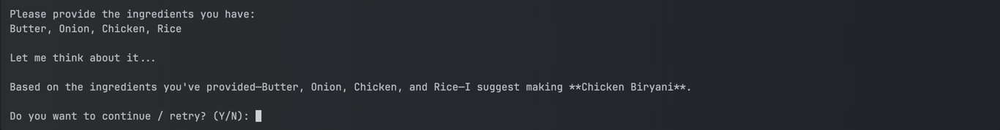

# Week 1 Project - AI GPT Bootcamp Q4 2024 - Encode Club

## Project Description

This project involves developing a Chef GPT Script with unique personalities that can:
- Give delicious dish ideas based on ingredients.
- Provide recipes for the dishes.
- Offer tips or critiques based on the ingredients.

Each script features a distinct AI chef personality. The AI responds to user inputs in three specific ways:
1. **Ingredient-based Dish Suggestions**: Suggests dish names based on provided ingredients.
2. **Recipe Requests for Specific Dishes**: Provides detailed recipes for requested dishes.
3. **Recipe Critiques and Improvement Suggestions**: Offers constructive critiques and improvement suggestions for provided recipes.

## Prerequisites
Before you begin, ensure you have met the following requirements:
- You have installed Python 3.8 or later.
- You have installed pip (Python package installer).
- You have set up your OpenAI API key.
- Make sure that the OpenAI API key is stored in an environment variable named exactly `OPENAI_API_KEY`.

## How to Run

Follow these steps to run the project:

1. **Clone the Repository**:
    ```sh
    git https://github.com/ifanzalukhu97/Week-1-Project-DeAI-Bootcamp-Q1-2025-Encode-Club.git
    cd Week-1-Project-DeAI-Bootcamp-Q1-2025-Encode-Club
    ```

2. **Create a Virtual Environment**:
    ```sh
    python -m venv .venv
    ```

3. **Activate the Virtual Environment**:
    - On macOS and Linux:
        ```sh
        source .venv/bin/activate
        ```
    - On Windows:
        ```sh
        .\venv\Scripts\activate
        ```

4. **Install the Required Packages**:
    ```sh
    pip install -r requirements.txt
    ```
   
5. **Run the Script**:
    ```sh
    python main.py
    ```

## Warning

If you encounter an error like this:
> openai.OpenAIError: The api_key client option must be set either by passing api_key to the client or by setting the OPENAI_API_KEY environment variable


It means that the OpenAI API key is not stored in your environment. Please store it in your environment variable.

Alternatively, you can hard code the API key in the Python file.

Change this code, from :
```python
client = OpenAI()
```
to :
```python
client = OpenAI("YOUR_OPENAI_API_KEY")
```
Replace "YOUR_OPENAI_API_KEY" with your actual OpenAI API key.

## Simple Report




## Contributors
- [ifanzalukhu97](https://github.com/ifanzalukhu97) (Unique ID: S3lFve)
- [nvinnikov](https://github.com/nvinnikov) (Unique ID: VvZfPu)
- [joyjsmun](https://github.com/joyjsmun) (Unique ID: OFVwFA)